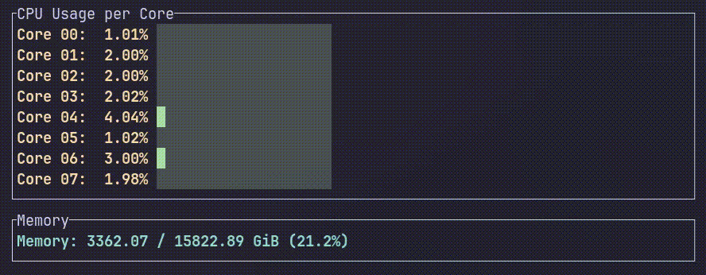

### SYSMON-rs

A system monitor utility written in rust.



### NOTE!
nix should be installed in your system or bare minimumly rust

1. clone the repo
```sh
git clone https://github.com/clouwud/sysmon-rs.git
```

2. cd into it
```sh
cd sysmon-rs
```

3. setup dev env
```sh
nix develop
```

4. run it
```sh
cargo run
```
